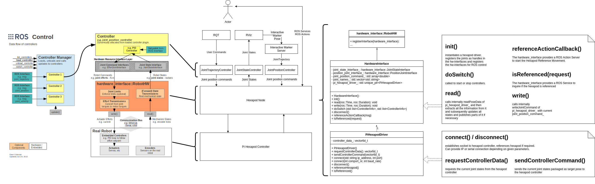

# PI Hexapod Control
This package contains the ROS Driver for Hexapods from Physik Intrumente (PI).

This includes a controller manager as standalone node as well as launch files and configurations
as easy starting point for your ROS application.

The package is using ROS control and builds on the known interfaces and paradigms.

## License
Please consider the license information provided with this repository.

## Setup
Due to the library used for connecting to the PI Hexapod, this Driver can only be used on x86
architectures.

A number of general ROS tutorials can be found at the [ROS wiki](http://wiki.ros.org/ROS/Tutorials).
To install ROS Melodic for Ubuntu 18.04 follow the instructions given at
[Melodic for Ubuntu](http://wiki.ros.org/melodic/Installation/Ubuntu).
For other ROS Distributions or target platforms, 
see [ROS Wiki](http://wiki.ros.org/ROS/Installation).

To create a workspace, refer to
[this tutorial](http://wiki.ros.org/ROS/Tutorials/InstallingandConfiguringROSEnvironment)
 or follow these abbreviated instructions for ROS Melodic:
```
    source /opt/ros/melodic/setup.bash
    mkdir -p ~/catkin_ws/src
    cd ~/catkin_ws/
    catkin_make
    source devel/setup.bash
```

Clone this repository, install dependencies and build the workspace:
```
    cd src
    # clone this repository: git clone ...
    cd ~/catkin_ws/
    rosdep install --from-paths src --ignore-src -r -y
    catkin_make
```

Now, the driver is ready to be used. For example, run the following command to start a simulated
hexapod and an interactive marker to control it:
```
    roslaunch pi_hexapod_control interactive_marker.launch sim:=true
```

## Usage

### Launch files
A number of launch files are included to serve as example on how to configure and use the Driver.

`hexapod_common_control.launch` provides an elaborate example on how to connect to a hexapod.
It can be used as standalone configuration to interact with hardware or a simulated hexapod.
Also, it can be easily included in other launch files, allowing for easy configuration due to using
smart default arguments.
For example, `interactive_marker.launch` and `rqt_gui.launch` build onto
`hexapod_common_control.launch` resulting in easy to understand configurations.
It is advised to not use the interactive marker and the RQT gui at the same time.


`interactive_marker.launch` provides an interactive marker server to control a hexapod via RViz.
For more information on its functionality, see \ref interactive_marker "Interactive Marker Node".

`rqt_gui.launch` provides an different interface to control a hexapod.
A precofigured RQT perspective with a costum control interface is launched.
If you expirience problems launching this RQT perspective, have a lock at the README provided with
the `pi_hexapod_gui` package for more details.

### Controller Manager Node
\anchor controller_manager_node
This node provides a controller manager and hardware interface to interact with a PI Hexapod.
The driver can connect to PI Hexapod Hardware via TCP/IP or serial connection.
Also, the hexapod can be simulated without requiring a connection to hardware.

#### Parameters:

Exactly one of `using_tcp_ip_connection` or `using_rs232_connection` needs to be set to true,
determining the connection type.

If TCP/IP is choosen, the string `hexapod_ip` needs to be set.
Additionally, the integer `hexapod_port` can be set, its default is 50000.

If serial connection is choosen, the integers `rs232_port_nr` and `baudrate` need to be specified.

`is_sim` can be set to true to use a simulated hexapod instead of a connection to a real one.
Its default value is false.

`auto_referencing` allows to start referencing the hexapod on startup without the need to call the
referencing action.

`prefer_stop_over_halt` allows to define the hardware behavior in case of a unexpected shutdown.
Setting this boolean to true results in the more strict STP command word being used to stop the
Hexapod instead of a HLT command. The parameters default value is false.

`hardware_interface/controller_rate`: positive double providing the main control loop rate in Hz,
default=1000

`hardware_interface/joints` and `hardware_interface/visual_joints` need to be set.
The `hardware_interface/` parameters are set via the provided `cfg/hexapod_controllers.yaml`.

#### Actions:
`referencing` of type `pi_hexapod_msgs::ReferencingAction`:
Allows to manually start the referencing of the hexapods axes.

### Interactive Marker Node
\anchor interactive_marker
This nodes provides an interactive marker server allowing the user to control the hexapod from RViz.

#### Parameters:
Direct node parameter:
`rate` (default=10): Command publishing rate
`autostart_publishing_commands` (default=false): interactive marker starts sending commands to
JointGroupPosController directly after startup, if set to true
`topic_ns` (default="pi\_interactive\_marker"): namespace in which to current marker pose is published

Parameter found in Hexapod configuration YAML:
`interactive_marker/control_scale` (default=1): scales the size of control elements
`interactive_marker/base_frame` (default="zero_link"): Frame name of the zero position frame of the
hexapod

`x/lower_limit`, `x/upper_limit`, `y/lower_limit`, `y/upper_limit`, `z/lower_limit`,
`z/upper_limit`, `u/lower_limit`, `u/upper_limit`, `v/lower_limit`, `v/upper_limit`,
`w/lower_limit`, `w/upper_limit`: defining movement limits

`interactive_marker/scale/x`, `interactive_marker/scale/y`, `interactive_marker/scale/z`,
`interactive_marker/position/x`, `interactive_marker/position/y`, `interactive_marker/position/z`,
`interactive_marker/orientation/w`, `interactive_marker/orientation/x`,
`interactive_marker/orientation/y`, `interactive_marker/orientation/z`,
`interactive_marker/color/r`, `interactive_marker/color/g`, `interactive_marker/color/b`,
`interactive_marker/color/a`: defining the optics of the interactive marker

#### Publisher:
`pose` of type `geometry_msgs::PoseStamped`:
Publishes the current pose of the interactive marker.

`command` of `std_msgs::Float64MultiArray`:
Publishes JointGroupPositionController command, if set to active via startup parameter,
service call or context menu in RViz.

#### Subcriber:
`joint_states` of type `sensor_msgs::JointState`: Requires current joint states of the hexapod.

#### Services:
Services can also be activated via the context menu in RViz accessed via right clicking the
interactive marker.

`activate_command_publishing` of type `std_srvs::SetBool`:
De-/activates command publishing.

`set_to_zero` of type `std_srvs::Empty`:
Resets marker position to zero.

`set_to_current` of `type std_srvs::Empty`:
Sets marker to current hexapod position.

`send_single_command` of type `std_srvs::Empty`:
Send a single command message to the `command` topic.

## Documentation
This package is documented with Doxygen (`apt install doxygen`).
Create the documentation by executing `doxygen Doxyfile` in the package root directory.
HTML documentation will be generated in the `doc/html` directory and can be easily accessed by
opening `doc/html/index.html` in a web browser.

## Software Architecture
The packages builds onto ROS Control and provides an abstraction of PI Hexapods by implementing
`hardware_interface::RobotHW` and a Controller Manager as standalone node.
`JointStateInterface` and `PositionJointInterface` are provided to be used with common ROS
Controllers or to develop costum ones.

The user can interact with the Hexapod through Controllers and tooling building onto them.
There are also direct interaction options with the controller, see
\ref controller_manager_node "Controller Manager Node" for details.

A sketch of the software architecture and possible User interfaces is provided as following:


